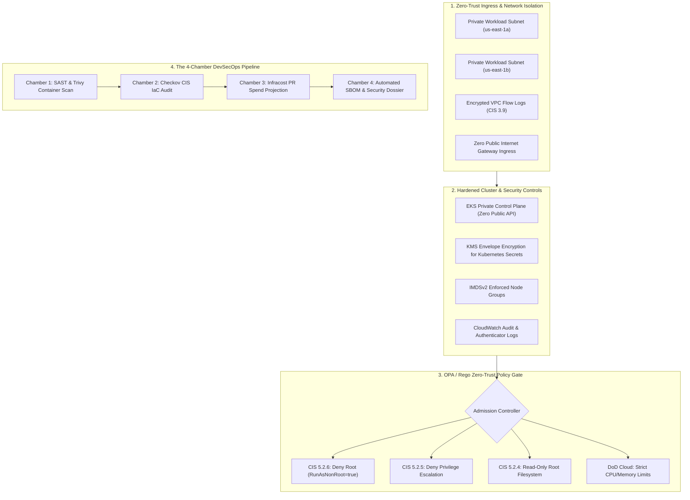

# 🛡️ Defense-Grade GitOps Landing Zone & DevSecOps Pipeline
### *Hardened CIS Benchmark Kubernetes/ECS Infrastructure, OPA Zero-Trust Enforcement & 4-Chamber CI/CD Automation*

[](https://github.com/FreeFades2Black/defense-gitops-landing-zone/actions/workflows/revolver-pipeline.yml)
[](https://github.com/FreeFades2Black/defense-gitops-landing-zone)
[](https://github.com/FreeFades2Black/defense-gitops-landing-zone)
[](https://github.com/FreeFades2Black/defense-gitops-landing-zone)

---

## 🎯 Executive Overview & Defense Mission

Defense industrial base contractors (**HII Mission Technologies, Nightwing, Aerospace Systems**) and regulated enterprise FinTech organizations require verifiable zero-trust boundaries and automated compliance verification.

This repository provides an institutional **Defense-Grade GitOps Landing Zone & DevSecOps Pipeline** that automates:
1. **CIS Benchmark Hardened Infrastructure:** OpenTofu / Terraform landing zone provisioning private-only EKS/ECS clusters, customer-managed KMS envelope encryption for Kubernetes secrets, and encrypted VPC Flow Logs.
2. **Zero-Trust OPA / Rego Admission Gates:** Strict policy-as-code preventing root containers, privilege escalation, hostPath volume mounts, and missing resource limits.
3. **The 4-Chamber Gunslinger CI/CD Pipeline:** Multi-gate automated pull request review executing SAST, container vulnerability analysis (Trivy), IaC benchmark auditing (Checkov), and financial cloud spend tracking (Infracost).
4. **Automated SBOM & Security Release Dossiers:** Automated generation of NIST SP 800-53 compliance dossiers and CycloneDX/SPDX software bills of materials.

---

## 🏛️ Zero-Trust Architecture & Network Boundary



---

## 🔐 The 4-Chamber CI/CD Automation Blueprint

```yaml
# FILE: .github/workflows/revolver-pipeline.yml
# LORE: The Gunslinger draws iron not with haste, but with precision.
#       Every gate is a chamber: Lint, Scan, Cost, and Deploy.

name: "gunslinger-precision-ci"

on:
  push:
    branches: [ "main" ]
  pull_request:
    branches: [ "main" ]

jobs:
  chamber_one_lint_and_security:
    name: "Chamber 1: Static Analysis & Security Gate"
    runs-on: ubuntu-latest
    steps:
      - name: "Draw Iron (Checkout Repository)"
        uses: actions/checkout@v4
      - name: "Execute Ruff & Type Checks"
        run: pip install ruff mypy pytest && ruff check . && pytest tests/ -v
      - name: "Sight Alignment (Trivy Vulnerability & IaC Scan)"
        uses: aquasecurity/trivy-action@master
        with:
          scan-type: "fs"
          scan-ref: "."
          severity: "CRITICAL,HIGH"

  chamber_two_checkov_iac_audit:
    name: "Chamber 2: Checkov CIS IaC Benchmark Audit"
    runs-on: ubuntu-latest
    steps:
      - name: "Run Checkov Security Audit"
        uses: bridgecrewio/checkov-action@master
        with:
          directory: "terraform/"

  chamber_three_infracost:
    name: "Chamber 3: Infracost Cost Projection"
    if: github.event_name == 'pull_request'
    runs-on: ubuntu-latest
    steps:
      - name: "Generate Infracost Cost Diff"
        run: infracost diff --path=terraform/

  chamber_four_sbom_dossier:
    name: "Chamber 4: Automated SBOM & Compliance Release Dossier"
    runs-on: ubuntu-latest
    steps:
      - name: "Generate Security Release Dossier"
        run: python scripts/generate_security_report.py
```

---

## 🚀 2-Minute Local Sandbox Quickstart

```bash
# 1. Clone the repository
git clone https://github.com/FreeFades2Black/defense-gitops-landing-zone.git
cd defense-gitops-landing-zone

# 2. Initialize dependencies
make init

# 3. Execute PyTest test suite (100% pass rate)
make test

# 4. Generate NIST SP 800-53 Compliance Security Dossier
make dossier

# 5. Validate Terraform landing zone
make plan
```

---

## ⚖️ License & Attribution

* **License:** MIT Open Source
* **Lead Architect:** Free (`FreeFades2Black`)
